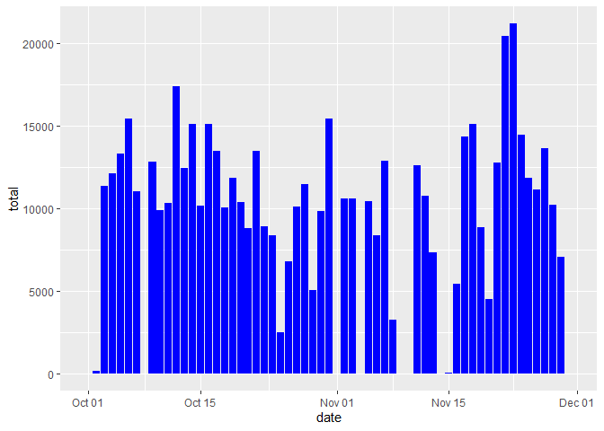
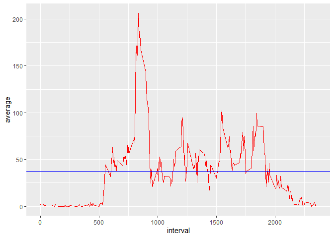
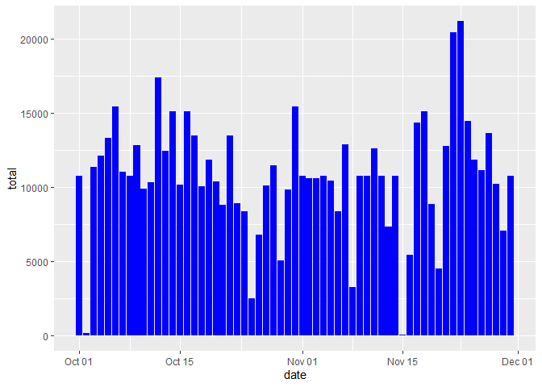
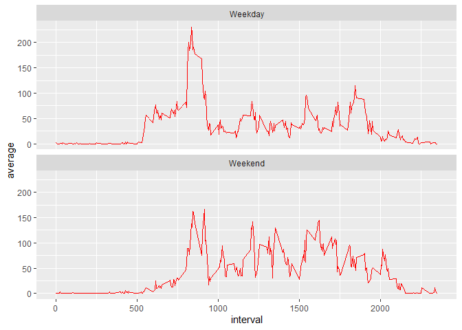

## Loading and preprocessing the data

```r
unzip("activity.zip", overwrite = TRUE)
data <- read.csv("activity.csv")
data$date <- as.Date(data$date)
```


## What is mean total number of steps taken per day?
#### 1. Calculate the total number of steps taken per day

```r
library(dplyr)
stepsperday <- data %>% 
     group_by(date) %>% 
     summarise(total = sum(steps, na.rm = TRUE)) %>% 
     print
```

```
## # A tibble: 61 x 2
##    date       total
##    <date>     <int>
##  1 2012-10-01     0
##  2 2012-10-02   126
##  3 2012-10-03 11352
##  4 2012-10-04 12116
##  5 2012-10-05 13294
##  6 2012-10-06 15420
##  7 2012-10-07 11015
##  8 2012-10-08     0
##  9 2012-10-09 12811
## 10 2012-10-10  9900
## # ... with 51 more rows
```

#### 2. Make a histogram of the total number of steps taken each day

```r
library(ggplot2)
ggplot(data = stepsperday, aes(x = date, y = total)) + 
     geom_bar(stat = "identity", fill = "blue")
```

<!-- -->

#### 3. Calculate and report the mean and median of the total number of steps taken per day

```r
meansteps <- mean(stepsperday$total)
mediansteps <- median(stepsperday$total)
```

Mean of total number of steps taken per day is **9354.2295082**  
Median of total number of steps taken per day is **10395**

## What is the average daily activity pattern
#### 1. Make a time series plot (i.e. type = "l") of the 5-minute interval (x-axis) and the average number of steps taken, averaged across all days (y-axis)

```r
stepsperinterval <- data %>%
     group_by(interval) %>%
     summarise(average = mean(steps, na.rm = TRUE))
ggplot(stepsperinterval, aes(x = interval)) + 
     geom_line(aes(y = average), color = "red") +
     geom_hline(yintercept = mean(stepsperinterval$average), color = "blue")
```

<!-- -->

#### 2. Which 5-minute interval, on average across all the days in the dataset, contains the maximum number of steps?

```r
stepsperinterval[stepsperinterval$average == max(stepsperinterval$average), 1][[1]]
```

```
## [1] 835
```

## Imputing missing values
Note that there are a number of days/intervals where there are missing values (coded as NA). The presence of missing days may introduce bias into some calculations or summaries of the data.

#### 1. Calculate and report the total number of missing values in the dataset (i.e. the total number of rows with NAs)

```r
sum(!complete.cases(data))
```

```
## [1] 2304
```

#### 2. Create a new dataset that is equal to the original dataset but with the missing data filled in.

```r
complete <- data %>%
     group_by(interval) %>%
     mutate(steps = replace(steps, is.na(steps), mean(steps, na.rm = TRUE))) %>%
     print
```

```
## # A tibble: 17,568 x 3
## # Groups:   interval [288]
##     steps date       interval
##     <dbl> <date>        <int>
##  1 1.72   2012-10-01        0
##  2 0.340  2012-10-01        5
##  3 0.132  2012-10-01       10
##  4 0.151  2012-10-01       15
##  5 0.0755 2012-10-01       20
##  6 2.09   2012-10-01       25
##  7 0.528  2012-10-01       30
##  8 0.868  2012-10-01       35
##  9 0      2012-10-01       40
## 10 1.47   2012-10-01       45
## # ... with 17,558 more rows
```

#### 3. Make a histogram of the total number of steps taken each day. 

```r
stepsperday2 <- complete %>% 
     group_by(date) %>% 
     summarise(total = sum(steps))
ggplot(data = stepsperday2, aes(x = date, y = total)) + 
     geom_bar(stat = "identity", fill = "blue")
```

<!-- -->

#### 4. Calculate and report the mean and median total number of steps taken per day. 

```r
(meansteps2 <- mean(stepsperday2$total))
```

```
## [1] 10766.19
```

```r
(mediansteps2 <- median(stepsperday2$total))
```

```
## [1] 10766.19
```

Mean of total number of steps taken per day is **1.0766189\times 10^{4}**  
Median of total number of steps taken per day is **1.0766189\times 10^{4}**  


#### 5. Do these values differ from the estimates from the first part of the assignment? What is the impact of imputing missing data on the estimates of the total daily number of steps?
Mean of total number of steps changed from **9354.2295082** (with NAs) to **1.0766189\times 10^{4}** (imputed NAs)  
Median of total number of steps changed from **10395** (with NAs) to **1.0766189\times 10^{4}** (imputed NAs)  

## Are there differences in activity patterns between weekdays and weekends?
#### 1. Create a new factor variable in the dataset with two levels – “weekday” and “weekend” indicating whether a given date is a weekday or weekend day.

```r
complete$daytype = as.factor(ifelse(weekdays(complete$date) %in% c("Saturday", "Sunday"), "Weekend", "Weekday"))
```

#### 2. Make a panel plot containing a time series plot (i.e. type = "l") of the 5-minute interval (x-axis) and the average number of steps taken, averaged across all weekday days or weekend days (y-axis). 

```r
stepsperinterval2 <- complete %>%
     group_by(daytype, interval) %>%
     summarise(average = mean(steps, na.rm = TRUE))
ggplot(stepsperinterval2, aes(interval, average)) + 
     geom_line(color = "red") +
     facet_wrap(~ daytype, ncol = 1)
```

<!-- -->
